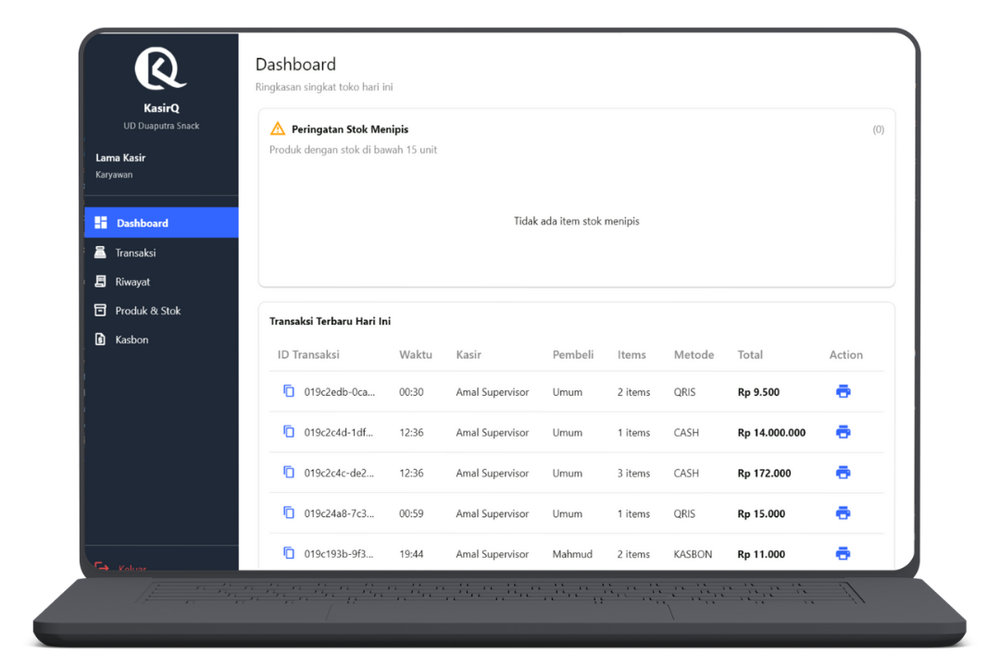

# Dashboard

  👤 Role: Kasir

Halaman **Dashboard Kasir** merupakan halaman utama yang digunakan kasir untuk memantau kondisi operasional harian secara cepat, tanpa perlu berpindah menu.

Dashboard ini berfokus pada:
- Informasi penting yang membutuhkan perhatian segera
- Ringkasan transaksi terbaru hari ini
- Akses cepat ke pencetakan nota

---

## Tujuan Dashboard Kasir

Dashboard ini dirancang agar kasir dapat:
- Mengetahui stok yang hampir habis
- Memastikan transaksi hari ini tercatat dengan benar
- Mencetak ulang nota dengan cepat
- Menghindari kesalahan operasional sejak awal

---

## Peringatan Stok

### Stok Hampir Habis

Bagian **Peringatan Stok** menampilkan daftar produk dengan kondisi:

- Stok berada di bawah batas minimum
- Produk berisiko habis dalam waktu dekat

Informasi yang ditampilkan meliputi:
- Nama produk
- Sisa stok
- Satuan

:::warning Perhatian
Kasir **tidak diperkenankan** melakukan perubahan stok langsung.
Segera laporkan ke supervisor jika stok hampir habis.
:::

---

## Transaksi Terbaru Hari Ini

Bagian ini menampilkan daftar transaksi yang dilakukan **pada hari yang sama**.

Fungsi utama:
- Validasi transaksi yang baru saja diproses
- Cetak ulang nota jika diperlukan
- Monitoring kesalahan input secara cepat

---

### Tabel Transaksi Hari Ini

| Kolom | Deskripsi |
|-----|----------|
| **ID Transaksi** | Kode unik transaksi |
| **Waktu** | Jam transaksi dilakukan |
| **Kasir** | Nama kasir yang melayani |
| **Pembeli** | Nama pembeli atau `(Tidak Terdaftar)` |
| **Items** | Jumlah item dalam transaksi |
| **Metode** | Metode pembayaran (Cash / QRIS / Kasbon) |
| **Total** | Total nilai transaksi |
| **Aksi** | Tindakan lanjutan |

---

### Aksi Transaksi

#### Cetak Nota

Pada kolom **Aksi**, kasir dapat:
- Mencetak ulang nota transaksi
- Memberikan salinan nota kepada pembeli

:::info Catatan
Cetak nota hanya berlaku untuk transaksi hari ini.
:::

---

## Perilaku Sistem

- Data transaksi ditampilkan secara **real-time**
- Dashboard akan otomatis diperbarui saat transaksi baru dibuat
- Data bersifat **read-only** (tidak dapat diubah)

---

## Tanggung Jawab Kasir

:::danger Penting
Sebagai kasir, Anda bertanggung jawab langsung terhadap transaksi yang Anda lakukan. Pastikan untuk:
- Memastikan item dan jumlah yang dimasukkan sudah benar
- Memilih metode pembayaran dengan tepat
- Memastikan nota tercetak dan diberikan ke pembeli
- Tidak meninggalkan sesi login dalam kondisi aktif
- Melaporkan kesalahan transaksi secepatnya ke supervisor
:::

:::tip Best Practice
- Cek peringatan stok sebelum mulai transaksi
- Pastikan transaksi berhasil sebelum menerima pembayaran
- Cetak ulang nota hanya jika diperlukan
- Logout setelah selesai bertugas
:::

---

## FAQ untuk Kasir

**Q: Mengapa stok muncul sebagai peringatan?**  
A: Karena stok produk sudah berada di bawah batas minimum yang ditentukan sistem.

**Q: Apakah kasir bisa mengubah data transaksi?**  
A: Tidak. Kasir hanya dapat membuat transaksi dan mencetak nota.

**Q: Bagaimana jika nota tidak tercetak?**  
A: Pastikan printer aktif. Jika masih gagal, hubungi supervisor.

**Q: Kenapa pembeli tertulis `(Tidak Terdaftar)`?**  
A: Karena transaksi dilakukan tanpa memilih data pembeli.

**Q: Apakah transaksi lama bisa muncul di dashboard?**  
A: Tidak. Dashboard hanya menampilkan transaksi pada hari berjalan.

---

## Catatan

Dashboard kasir bersifat **operasional**, bukan laporan.  
Untuk analisis data, gunakan menu **Laporan** atau **Riwayat Transaksi** (Supervisor).

