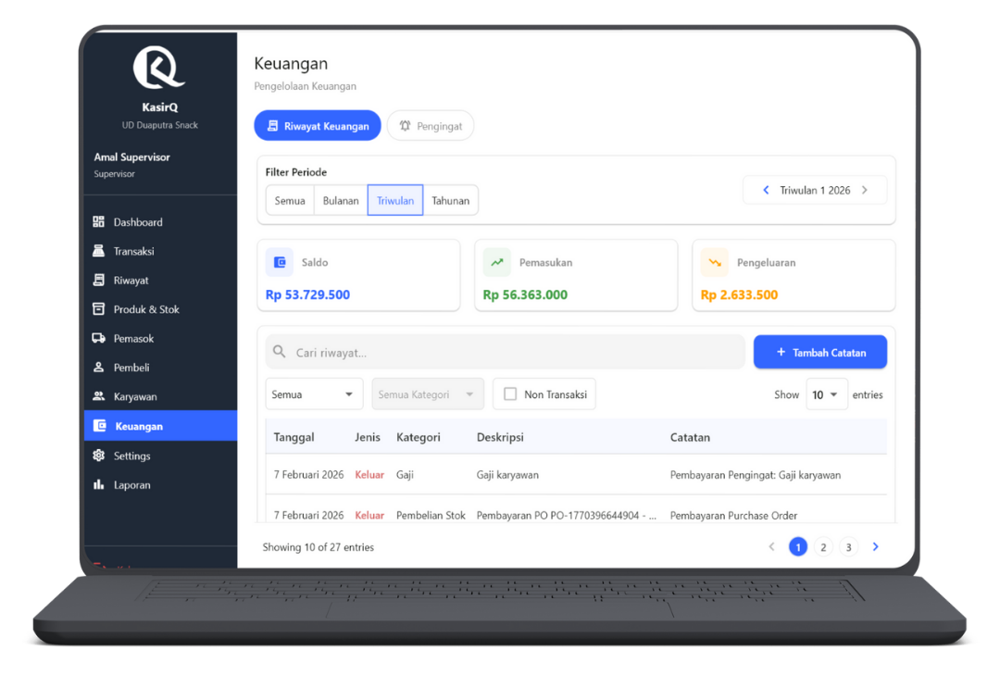

# Keuangan & Pengingat Pembayaran

  👤 Role: Supervisor

Halaman **Keuangan & Pengingat Pembayaran** digunakan oleh Supervisor untuk memantau arus kas toko, mencatat pemasukan dan pengeluaran non-transaksi, serta mengelola pengingat pembayaran rutin agar tidak terlewat.

Fitur ini terbagi menjadi **2 tab utama**.

---

## Ringkasan Tab

1. **Riwayat Keuangan** – Pencatatan dan monitoring arus kas
2. **Pengingat Pembayaran** – Pengelolaan tagihan dan pembayaran berkala

---

## Tab 1 — Riwayat Keuangan

Tab ini menampilkan seluruh **catatan keuangan non-transaksi kasir**, seperti biaya operasional, pemasukan tambahan, dan pengeluaran rutin.

---

## Filter Periode

Supervisor dapat memilih periode data:

- **Semua**
- **Bulanan**
- **Triwulan**
- **Tahunan**

Jika memilih selain **Semua**, Supervisor wajib menentukan periode waktu.

---

## Card Summary Keuangan

Berdasarkan periode yang dipilih, sistem menampilkan:

- **Saldo**
- **Total Pemasukan**
- **Total Pengeluaran**

Ringkasan ini otomatis menyesuaikan dengan filter periode.

---

## Tabel Riwayat Keuangan

### Fitur Tabel

Supervisor dapat:
- Mencari catatan keuangan
- Menambah catatan manual
- Memfilter data
- Melihat detail catatan

---

### Filter & Kontrol

- **Search** (deskripsi / kategori)
- Tombol **Tambah Catatan**
- Filter **Tipe**:
  - Semua
  - Pemasukan
  - Pengeluaran
- Filter **Kategori**  
  *(Kategori hanya aktif setelah tipe dipilih)*
- Checklist **Non Transaksi**
- **Show entries**
- **Pagination**

---

### Struktur Tabel

| Kolom | Deskripsi |
|----|----|
| Tanggal | Tanggal pencatatan |
| Jenis | Pemasukan / Pengeluaran |
| Kategori | Kategori keuangan |
| Deskripsi | Ringkasan transaksi |
| Catatan | Keterangan tambahan |
| Jumlah | Nominal |
| Metode | Cash / QRIS / Kasbon / Transfer |
| Aksi | Detail |

---

## Tambah Catatan Keuangan

Klik tombol **Tambah Catatan** untuk membuka dialog.

### Form Tambah Catatan

#### Pilih Tipe
- **Pemasukan**
- **Pengeluaran**

#### Field Wajib
- Kategori
- Jumlah
- Metode pembayaran:
  - Cash
  - QRIS
  - Kasbon
  - Transfer
- Tanggal
- Deskripsi

#### Field Opsional
- Catatan tambahan

Klik **Simpan** untuk mencatat keuangan.

:::info Catatan
Catatan keuangan ini tidak mempengaruhi transaksi kasir.
:::

---

## Tab 2 — Pengingat Pembayaran

Tab ini digunakan untuk mengelola **pengingat pembayaran rutin**, seperti:
- Langganan
- Tagihan bulanan
- Pengeluaran berkala

---

## Tambah Pengingat

Klik tombol **Tambah Pengingat**.

### Informasi Penting Tanggal

:::warning Penting
Tanggal tidak selalu tersedia di semua bulan:
- **31** → tidak ada di Apr, Jun, Sep, Nov
- **Februari** → 28 / 29

Jika tanggal tidak tersedia, sistem akan otomatis
mengatur pengingat ke **tanggal terakhir bulan tersebut**.
:::

---

### Form Tambah Pengingat

Field yang harus diisi:
- Deskripsi
- Kategori
- Jumlah
- Frekuensi:
  - **Bulanan** (isi tanggal dalam bulan)
  - **Sekali** (tanggal jatuh tempo berikutnya)

Klik **Simpan** untuk membuat pengingat.

---

## Tabel Pengingat Pembayaran

| Kolom | Deskripsi |
|----|----|
| Deskripsi | Nama pengingat |
| Kategori | Kategori biaya |
| Jumlah | Nominal |
| Frekuensi | Bulanan / Sekali |
| Jatuh Tempo | Tanggal berikutnya |
| Sisa | Sisa waktu |
| Status | Aktif / Nonaktif |
| Aksi | Bayar / Edit / Hapus |

---

## Aksi Pengingat

### Bayar Pengingat

Klik **Bayar** untuk membuka dialog.

#### Informasi Pengingat
- Deskripsi
- Kategori
- Jatuh tempo
- Sisa waktu
- Jumlah

#### Form Pembayaran
- Pilih metode pembayaran:
  - Cash
  - QRIS
  - Transfer

Klik **Bayar** untuk menyelesaikan tagihan.

:::info Catatan
Pembayaran dianggap **lunas penuh**.
:::

---

### Edit Pengingat

Form edit hampir sama dengan tambah pengingat, ditambah:
- Toggle **Aktif / Nonaktif**

---

### Detail Pengingat

Menampilkan riwayat pembayaran dengan tabel:

| Kolom | Deskripsi |
|----|----|
| Tanggal | Tanggal pembayaran |
| Jenis | Pemasukan / Pengeluaran |
| Kategori | Kategori |
| Deskripsi | Deskripsi |
| Catatan | Catatan |
| Jumlah | Nominal |
| Metode | Metode pembayaran |

---

## Tanggung Jawab Supervisor

:::danger Penting
Supervisor bertanggung jawab atas:
- Keakuratan catatan keuangan
- Konsistensi kategori keuangan
- Monitoring arus kas
- Ketepatan pembayaran tagihan
- Pengelolaan pengingat pembayaran rutin
:::

Kelalaian dapat menyebabkan ketidakseimbangan laporan keuangan.

---

## FAQ — Keuangan & Pengingat

**Q: Apakah catatan keuangan bisa diedit?**  
A: Tidak. Catatan bersifat final dan hanya bisa dilihat detailnya.

**Q: Apakah pengingat bisa dimatikan sementara?**  
A: Bisa, gunakan toggle status Aktif / Nonaktif.

**Q: Apa bedanya kasbon di transaksi dan keuangan?**  
A: Kasbon transaksi terkait penjualan, sedangkan kasbon keuangan terkait biaya operasional.

**Q: Jika tanggal tidak ada di bulan tertentu?**  
A: Sistem otomatis menggunakan tanggal terakhir bulan tersebut.

---

Halaman ini hanya dapat diakses oleh **Supervisor** dan berperan penting dalam **pengelolaan keuangan toko**.
