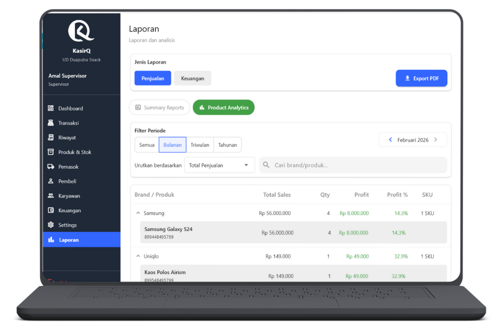
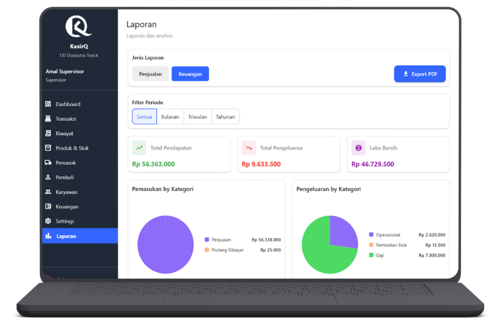

# Laporan & Analitik

  👤 Role: Supervisor

Halaman **Laporan & Analitik** digunakan oleh Supervisor untuk melakukan evaluasi menyeluruh terhadap performa penjualan dan kondisi keuangan toko berdasarkan data transaksi yang tercatat di sistem.

Halaman ini berfungsi sebagai **alat pengambilan keputusan**, bukan sekadar tampilan data. Oleh karena itu, seluruh informasi yang ditampilkan bersifat agregat, terstruktur, dan dapat difilter sesuai kebutuhan analisis.

---

## Fitur Utama

Pada halaman ini Supervisor dapat:
- Melihat ringkasan performa penjualan
- Menganalisis produk dan brand terlaris
- Memantau arus keuangan dan laba bersih
- Mengekspor laporan ke format **PDF**
- Memfilter laporan berdasarkan periode dan jenis laporan

---

## Export Laporan PDF

Tersedia tombol **Export Laporan PDF** yang dapat digunakan kapan saja.

Sebelum melakukan export, Supervisor dapat mengatur:
- **Rentang tanggal laporan**
- **Periode laporan**:
  - Harian
  - Bulanan
  - Tahunan
- **Jenis laporan**:
  - Semua
  - Penjualan
  - Produk
  - Keuangan

File PDF yang dihasilkan akan tersimpan dan tercatat pada **Riwayat Laporan** di menu Pengaturan Aplikasi.

:::info Catatan
Export laporan hanya menghasilkan data berdasarkan filter yang sedang aktif.
:::

---

## Struktur Tab

Halaman Laporan terdiri dari **2 tab utama**:

1. **Laporan Penjualan**
2. **Laporan Keuangan**

---

## Tab 1 — Laporan Penjualan

Tab ini digunakan untuk menganalisis performa penjualan toko dari sisi transaksi, produk, dan kategori.

Di dalamnya terdapat **2 sub-tab**.

---

### Sub-Tab 1 — Summary Reports

Sub-tab ini menampilkan ringkasan performa penjualan secara global.

---

#### Filter Periode

Filter periode yang tersedia:
- Semua
- Bulanan
- Triwulan
- Tahunan

Untuk selain **Semua**, Supervisor wajib memilih waktu spesifik yang akan dianalisis.

---

#### Card Summary

Informasi ringkasan yang ditampilkan:
- **Total Pendapatan** – Akumulasi seluruh transaksi penjualan
- **Total Profit** – Selisih pendapatan dan harga modal
- **Jumlah Transaksi** – Total transaksi yang terjadi
- **Rata-rata Margin Profit** – Persentase profit rata-rata per transaksi

Card ini akan berubah secara dinamis mengikuti filter periode.

---

#### Tren Penjualan

Ditampilkan dalam bentuk **Line Chart** yang menunjukkan:
- Perubahan pendapatan dari waktu ke waktu
- Pola kenaikan atau penurunan penjualan

Grafik ini membantu Supervisor membaca tren musiman atau anomali penjualan.

---

#### Top 5 Penjualan Berdasarkan Kategori

Ditampilkan dalam **Pie Chart**.

- Menampilkan 5 kategori dengan kontribusi penjualan terbesar
- Dilengkapi dengan legenda warna untuk setiap kategori
- Persentase menunjukkan kontribusi terhadap total penjualan

---

#### Distribusi Metode Pembayaran

Ditampilkan dalam **Pie Chart** yang menunjukkan proporsi:
- Cash
- QRIS
- Kasbon
- Transfer

Setiap metode memiliki warna pembeda dan keterangan jumlah serta persentase.

---

#### Top 10 Produk Terlaris

Ditampilkan dalam **Bar Chart**.

- Berdasarkan jumlah penjualan
- Memudahkan identifikasi produk dengan performa tertinggi
- Cocok untuk evaluasi stok dan strategi promosi

---

### Sub-Tab 2 — Product Analytics

Sub-tab ini digunakan untuk analisis mendalam performa produk dan brand.

---

#### Filter & Sorting

Fitur yang tersedia:
- Filter periode (Semua, Bulanan, Triwulan, Tahunan)
- Urutkan berdasarkan:
  - Total penjualan
  - Jumlah terjual
  - Total profit
- Pencarian berdasarkan **Brand** atau **Nama Produk**

---

#### Tabel Analitik Produk

Kolom tabel utama:
- Nama Brand
- Total Penjualan
- Quantity Terjual
- Total Profit
- Profit (%)
- SKU

Setiap baris **Brand** dapat diklik untuk menampilkan detail produk di bawahnya.

---

#### Detail Produk per Brand

Saat baris brand dibuka, akan ditampilkan daftar produk terkait:
- Nama produk
- Total penjualan produk
- Quantity terjual
- Profit per produk

Fitur ini membantu Supervisor mengidentifikasi:
- Produk unggulan
- Produk dengan margin rendah
- Produk yang perlu evaluasi harga atau stok

---

## Tab 2 — Laporan Keuangan

Tab ini digunakan untuk memantau kondisi keuangan toko secara keseluruhan.

---

### Filter Periode

Filter periode yang tersedia:
- Semua
- Bulanan
- Triwulan
- Tahunan

Filter ini memengaruhi seluruh data dan grafik yang ditampilkan.

---

### Card Summary Keuangan

Informasi yang ditampilkan:
- **Total Pendapatan**
- **Total Pengeluaran**
- **Laba Bersih** (Pendapatan – Pengeluaran)

Nilai laba bersih dapat bernilai negatif jika pengeluaran melebihi pendapatan.

---

### Pemasukan Berdasarkan Kategori

Ditampilkan dalam **Pie Chart**:
- Menunjukkan sumber pemasukan
- Dilengkapi legenda warna dan persentase

---

### Pengeluaran Berdasarkan Kategori

Ditampilkan dalam **Pie Chart**:
- Menunjukkan distribusi pengeluaran
- Membantu evaluasi biaya operasional

---

### Tren Pendapatan Bersih

Ditampilkan dalam **Line Chart**.

- Menampilkan perubahan laba bersih dari waktu ke waktu
- Dapat menunjukkan nilai negatif
- Digunakan untuk mendeteksi masalah keuangan lebih awal

---

## Tanggung Jawab Supervisor

:::danger Penting
Supervisor bertanggung jawab penuh atas:
- Validitas analisis laporan
- Penggunaan data laporan untuk pengambilan keputusan
- Kerahasiaan data keuangan
- Export dan distribusi laporan ke pihak terkait
- Tidak menyalahgunakan data laporan untuk manipulasi internal
:::

Kesalahan interpretasi laporan dapat berdampak langsung pada kebijakan bisnis toko.

---

## FAQ

**Q: Apakah kasir bisa mengakses laporan ini?**  
A: Tidak. Seluruh menu Laporan & Analitik hanya dapat diakses oleh Supervisor.

**Q: Apakah laporan bisa diekspor ke Excel?**  
A: Saat ini hanya tersedia export ke PDF untuk menjaga konsistensi format.

**Q: Kenapa data laporan berbeda setelah reset atau sinkronisasi?**  
A: Laporan dihitung ulang berdasarkan data transaksi yang tersedia saat itu.

**Q: Apakah laporan real-time?**  
A: Ya. Data laporan selalu mengikuti data transaksi terbaru di sistem.
