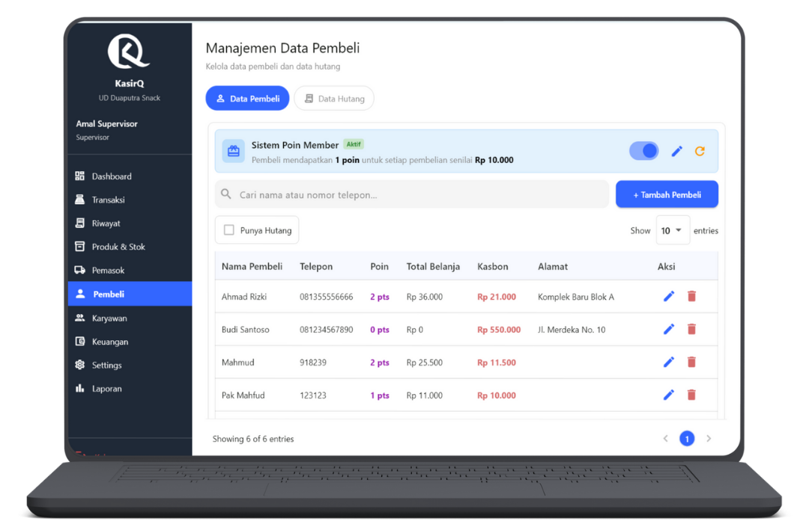
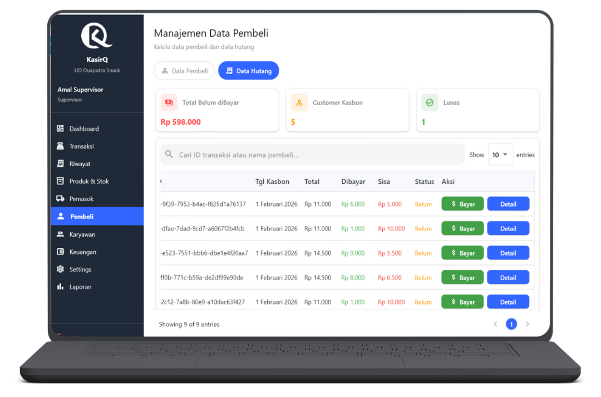

# Data Pembeli & Data Hutang

  👤 Role: Supervisor

Halaman **Data Pembeli & Data Hutang** digunakan oleh Supervisor untuk mengelola data pembeli, sistem poin member, serta seluruh transaksi **kasbon (hutang pembeli)** secara terstruktur dan terdokumentasi.

Fitur pada halaman ini dibagi menjadi **2 tab utama** untuk memisahkan pengelolaan data pelanggan dan pengawasan hutang.

---

## Ringkasan Tab

1. **Data Pembeli** – Kelola data pembeli & sistem poin
2. **Data Hutang** – Monitoring dan pembayaran kasbon

---

## Tab 1 — Data Pembeli

Tab **Data Pembeli** digunakan untuk mengelola seluruh data pelanggan yang terdaftar di sistem, termasuk **sistem poin member** dan informasi kasbon.

---

## Sistem Poin Member

Di bagian atas halaman terdapat **card pengaturan sistem poin**.

### Skema Default

- **1 poin** untuk setiap pembelian senilai **Rp10.000**

### Fitur Pengaturan

Supervisor dapat:
- **Mengaktifkan / menonaktifkan** sistem poin (Toggle ON / OFF)
- Mengubah:
  - Nilai poin
  - Nilai minimum pembelian
- **Reset seluruh poin member**

:::warning Perhatian
Reset poin akan menghapus seluruh poin pembeli dan tidak dapat dibatalkan.
:::

---

## Pencarian & Filter Pembeli

### Pencarian

Kolom pencarian mendukung:
- **Nama pembeli**
- **Nomor telepon**

Pencarian bersifat **real-time**.

---

### Filter Tambahan

- Checklist **Memiliki Hutang (Kasbon)**
- Show entries
- Pagination

---

### Tambah Pembeli

Klik tombol **Tambah Pembeli** untuk membuka form.

#### Form Tambah / Edit Pembeli

Field:
- Nama pembeli *(wajib)*
- Nomor telepon *(wajib)*
- Alamat *(opsional)*
- Keterangan *(opsional)*

Form edit memiliki struktur yang sama dengan form tambah.

---

### Tabel Data Pembeli

| Kolom | Deskripsi |
|----|----|
| Nama Pembeli | Nama pelanggan |
| Telepon | Nomor telepon |
| Poin | Total poin member |
| Total Belanja | Akumulasi transaksi |
| Kasbon | Total hutang aktif |
| Alamat | Alamat pembeli |
| Aksi | Edit / Hapus |

---

### Tambah Hutang

Tombol **Tambah Hutang** digunakan untuk:
- Mencatat kasbon manual
- Kondisi khusus di luar transaksi kasir

:::info Catatan
Kasbon normal dari transaksi akan tercatat otomatis.
:::

---

## Tab 2 — Data Hutang

Tab **Data Hutang** digunakan untuk memantau seluruh hutang pembeli, status pembayaran, dan riwayat pelunasan.

---

## Card Summary Hutang

Di bagian atas halaman ditampilkan ringkasan:

- **Total Belum Dibayar**
- **Jumlah Pembeli dengan Kasbon**
- **Jumlah Hutang Lunas**

Ringkasan ini bersifat **real-time**.

---

## Pencarian & Navigasi

### Pencarian Hutang

Pencarian berdasarkan:
- **ID Transaksi**
- **Nama Pembeli**

---

### Navigasi Data

- Show entries: 10 / 20 / 50
- Pagination

---

## Tabel Data Hutang

| Kolom | Deskripsi |
|----|----|
| Nama Pembeli | Nama pelanggan |
| ID Transaksi | Referensi transaksi |
| Jatuh Tempo | Tanggal jatuh tempo |
| Total | Total hutang |
| Dibayar | Total sudah dibayar |
| Sisa | Sisa hutang |
| Status | Belum Lunas / Lunas |
| Aksi | Bayar / Detail |

---

## Aksi Bayar Hutang

Klik tombol **Bayar** untuk membuka dialog pembayaran.

### Informasi Kasbon

Ditampilkan secara ringkas:
- Nama pembeli
- ID transaksi
- Total hutang
- Sudah dibayar
- Sisa hutang

---

### Form Pembayaran Hutang

Field pembayaran:
- Jumlah pembayaran
- Tombol bantuan:
  - **Bayar Lunas**
  - **Bayar 50%**
- Jatuh tempo berikutnya *(opsional jika diperpanjang)*
- Metode pembayaran

Klik **Bayar** untuk menyimpan pembayaran.

:::warning Perhatian
Pembayaran parsial akan:
- Mengurangi sisa hutang
- Mengubah status menjadi tetap **Belum Lunas**
:::

---

## Detail Hutang

Klik tombol **Detail** untuk melihat informasi lengkap.

### Informasi Umum

- Nama pembeli
- ID transaksi
- Total hutang
- Sudah dibayar
- Sisa hutang
- Jatuh tempo

---

### Riwayat Pembayaran

Tabel riwayat pembayaran:

| Tanggal | Jumlah | Metode | Penerima |
|----|----|----|----|

Riwayat ini bersifat **audit log** dan tidak dapat diubah.

---

## Tanggung Jawab Supervisor

:::danger Penting
Supervisor bertanggung jawab atas:
- Validitas data pembeli
- Pengaturan sistem poin
- Pencatatan kasbon
- Pembayaran hutang
- Perubahan jatuh tempo
- Transparansi piutang usaha
:::

Kesalahan pencatatan hutang akan berdampak langsung pada laporan keuangan.

---

## FAQ — Data Pembeli & Hutang

**Q: Apakah sistem poin wajib diaktifkan?**  
A: Tidak. Sistem poin dapat dimatikan kapan saja.

**Q: Apakah poin bisa diedit manual?**  
A: Bisa, namun hanya oleh Supervisor.

**Q: Apakah hutang selalu berasal dari transaksi?**  
A: Tidak. Hutang bisa dicatat manual melalui tombol Tambah Hutang.

**Q: Apakah hutang bisa dihapus?**  
A: Tidak. Hutang hanya bisa dilunasi, bukan dihapus.

**Q: Apakah pembeli bisa dihapus?**  
A: Bisa, selama tidak memiliki hutang aktif.

---

Halaman ini bersifat **sensitif terhadap piutang usaha**.
