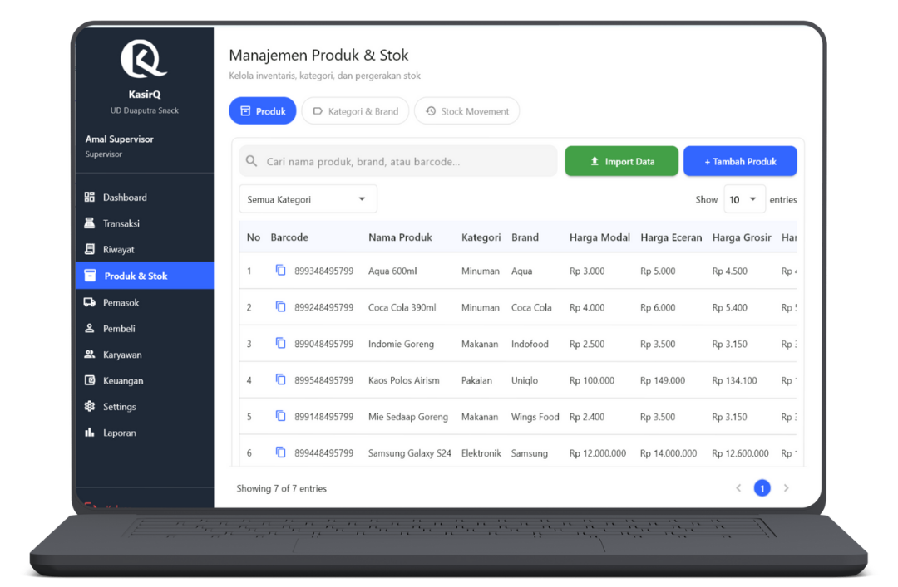
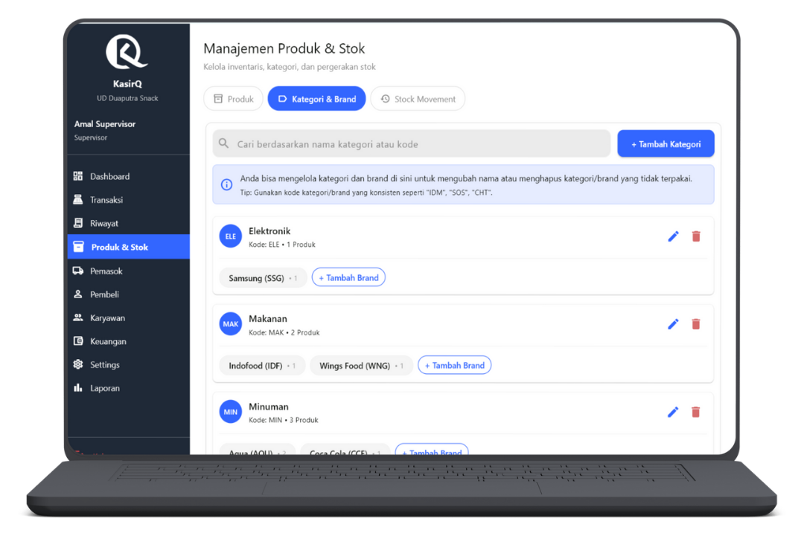
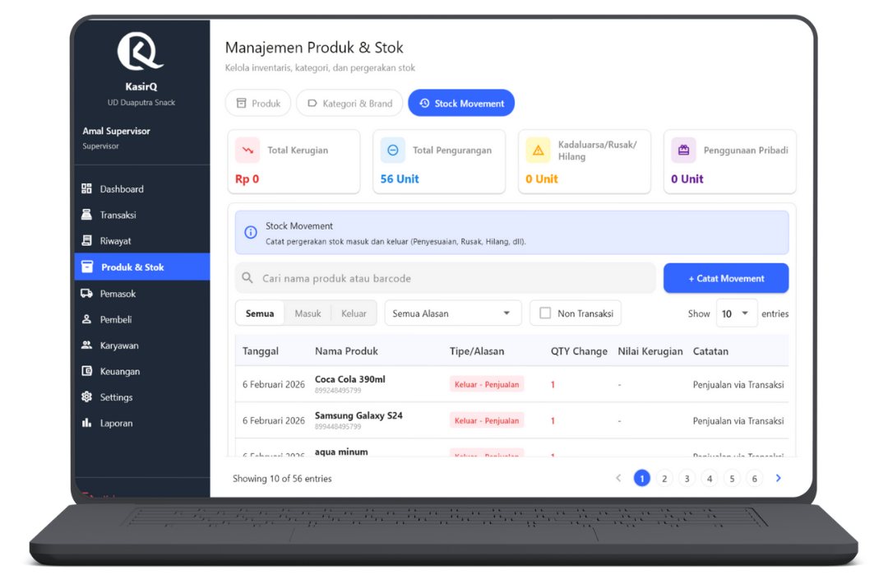

# Kelola Produk & Stok

  👤 Role: Supervisor

Halaman **Kelola Produk & Stok** digunakan oleh Supervisor untuk mengelola seluruh data produk, kategori, brand, serta pergerakan stok secara terkontrol dan terdokumentasi.

Fitur pada halaman ini terbagi ke dalam **4 tab utama** untuk memisahkan tanggung jawab dan mencegah kesalahan operasional.

---

## Ringkasan Tab

1. **Produk** – Kelola data produk dan harga
2. **Kategori & Brand** – Kelola struktur kategori dan brand
3. **Stock Movement** – Pencatatan pergerakan stok (masuk / keluar)
4. **Penyesuaian Stok** – Koreksi stok non-transaksi *(jika dipisah secara UI)*

---

## Tab 1 — Produk

Tab **Produk** digunakan untuk mengelola data produk dan informasi stok secara umum.

### Fitur Utama

Supervisor dapat:
- Mencari produk
- Import data produk massal
- Menambah produk baru
- Memfilter berdasarkan kategori
- Mengedit produk
- Menghapus produk
- Melihat margin keuntungan

---

### Pencarian Produk

Kolom pencarian mendukung pencarian berdasarkan:
- **Nama produk**
- **Brand**
- **Barcode**

Pencarian bersifat **real-time**.

---

### Import Data Produk

Fitur **Import Produk** digunakan untuk menambahkan banyak produk sekaligus.

#### Alur Import

  
1

  

    <h3>Unduh Template</h3>
    
Unduh template resmi yang disediakan di form import.

  

  
2

  

    <h3>Isi Data Produk</h3>
    
Isi file sesuai format template. Jangan ubah header kolom.

  

  
3

  

    <h3>Simpan sebagai CSV</h3>
    
WAJIB simpan file sebagai <strong>CSV (Comma Delimited)</strong>.

  

  
4

  

    <h3>Unggah File</h3>
    
Klik <strong>Unggah</strong> dan tunggu notifikasi.

  

#### Notifikasi Import
- **Success** → Semua data valid
- **Error** → Ada kesalahan format, duplikasi barcode, atau data tidak valid

:::danger Penting
Import akan gagal jika:
- Header tidak sesuai template
- File bukan CSV
- Barcode atau kode kategori tidak ditemukan
:::

---

### Tambah Produk

Klik tombol **Tambah Produk** untuk membuka form.

#### Informasi Dasar (Wajib)

- Barcode
- Nama produk
- Pilih **Kategori**
- Pilih **Brand**  
  *(Brand hanya muncul setelah kategori dipilih)*
- Stok awal

#### Informasi Harga

- Harga modal
- Harga eceran
- Harga grosir
- Harga reseller

Sistem akan otomatis menampilkan:
- **Profit eceran**
- **Profit grosir**
- **Profit reseller**

Profit dihitung berdasarkan **harga modal**.

---

### Tabel Produk

| Kolom | Deskripsi |
|----|----|
| No | Nomor urut |
| Barcode | Kode barcode produk |
| Nama Produk | Nama produk |
| Kategori | Kategori produk |
| Brand | Brand produk |
| Harga Modal | Harga beli |
| Harga Eceran | Harga jual ecer |
| Harga Grosir | Harga jual grosir |
| Harga Reseller | Harga reseller |
| Stok | Jumlah stok |
| Profit | Margin keuntungan |
| Aksi | Edit / Hapus |

#### Catatan Edit
- Semua data **bisa diedit**
- **Stok TIDAK bisa diedit di tab ini**
- Edit stok hanya boleh melalui **Stock Movement / Penyesuaian Stok**

---

## Tab 2 — Kategori & Brand

Tab ini digunakan untuk mengelola struktur produk.

### Fitur

- Cari kategori
- Tambah kategori
- Tambah brand
- Edit kategori / brand
- Hapus kategori / brand

---

### Pencarian

Pencarian berdasarkan:
- **Nama kategori**
- **Kode kategori**

---

### List Kategori

| Kolom | Deskripsi |
|----|----|
| Nama Kategori | Nama kategori |
| Kode Kategori | Kode unik |
| Jumlah Produk | Total produk di kategori |
| Brand | Daftar brand & kode |
| Aksi | Edit / Hapus |

---

### Tambah Kategori

Form tambah kategori:
- Nama kategori
- Kode kategori *(harus unik)*

---

### Tambah Brand

Klik **Tambah Brand** pada kategori terkait, lalu isi:
- Nama brand
- Kode brand *(harus unik)*

:::info Catatan
1 kategori dapat memiliki **banyak brand**.
:::

---

## Tab 3 — Stock Movement (Penyesuaian Stok)

Tab ini digunakan untuk mencatat seluruh **pergerakan stok masuk dan keluar** yang **bukan transaksi kasir langsung**.

---

### Card Summary

- **Total Kerugian**
- **Total Pengurangan Stok**
- **Kadaluarsa / Rusak / Hilang**
- **Penggunaan Pribadi**

---

### Fitur Pencarian & Filter

- Cari berdasarkan **nama produk** atau **barcode**
- Tombol **Catat Movement**
- Filter Tipe:
  - Semua
  - Masuk
  - Keluar
- Filter Alasan:
  - Barang masuk
  - Penyesuaian
  - Pengembalian
  - Penjualan
  - Kadaluarsa
  - Rusak
  - Hilang
- Checklist **Non Transaksi**
- Show entries
- Pagination

---

### Catat Stock Movement

Tombol **Catat Movement** digunakan untuk mencatat **pergerakan stok secara manual** yang **tidak berasal dari transaksi otomatis sistem**.

Fitur ini hanya dapat digunakan oleh **Supervisor**.

---

### Form Dialog — Tambah Movement

Saat tombol **Catat Movement** diklik, sistem akan menampilkan **dialog form** dengan tahapan berikut:

  
1

  

    <h3>Pilih Tipe Movement</h3>
    <ul>
      <li><strong>Masuk</strong> → stok bertambah</li>
      <li><strong>Keluar</strong> → stok berkurang</li>
    </ul>
    
Tipe movement menentukan arah perubahan stok dan pencatatan laporan.

  

  
2

  

    <h3>Pilih Produk</h3>
    
Produk dipilih melalui pencarian berdasarkan nama produk atau barcode. Hanya produk yang <strong>sudah terdaftar</strong> di sistem yang dapat dipilih. Produk <strong>tidak dapat ditambahkan</strong> dari form ini.

  

  
3

  

    <h3>Pilih Alasan</h3>
    
Alasan movement <strong>wajib dipilih</strong> untuk kebutuhan audit.

    <ul>
      <li>Barang masuk</li>
      <li>Penyesuaian stok</li>
      <li>Pengembalian barang</li>
      <li>Kadaluarsa</li>
      <li>Rusak</li>
      <li>Hilang</li>
      <li>Penggunaan pribadi</li>
    </ul>
    
Alasan akan memengaruhi kategori laporan dan perhitungan nilai kerugian (jika ada).

  

  
4

  

    <h3>Jumlah (Qty)</h3>
    <ul>
      <li>Diisi dengan jumlah stok yang masuk atau keluar</li>
      <li>Nilai harus <strong>lebih dari 0</strong></li>
      <li>Sistem otomatis menyesuaikan stok berdasarkan tipe (Masuk / Keluar)</li>
    </ul>
  

  
5

  

    <h3>Catatan</h3>
    
Kolom catatan bersifat <strong>opsional</strong>, namun sangat dianjurkan, terutama untuk movement <strong>Keluar</strong>. Digunakan untuk penjelasan tambahan, nomor dokumen internal, atau klarifikasi kondisi barang.

  

  
6

  

    <h3>Simpan Movement</h3>
    <ul>
      <li>Stok produk akan langsung diperbarui</li>
      <li>Data tercatat di tabel <strong>Stock Movement</strong></li>
      <li>Data <strong>tidak dapat dihapus atau diedit</strong></li>
    </ul>
  

:::warning Penting
Stock Movement **manual** hanya digunakan untuk kondisi **non-transaksi**, seperti:
- Penyesuaian stok
- Barang rusak / hilang
- Penggunaan internal

Movement **tidak perlu dicatat manual** jika berasal dari:
- Transaksi penjualan
- Transaksi pembelian
- Proses Purchase Order
:::

---

### Movement Otomatis oleh Sistem

Pergerakan stok akan **tercatat otomatis** oleh sistem jika berasal dari:
- Transaksi kasir (penjualan)
- Penerimaan barang dari **Purchase Order**
- Retur transaksi (jka tersedia)

Pada kondisi ini:
- Supervisor **tidak perlu** mencatat movement manual
- Sistem akan menentukan tipe, alasan, dan qty secara otomatis

---

:::danger Audit
Semua data Stock Movement digunakan sebagai:
- Jejak audit stok
- Dasar laporan kerugian
- Validasi stok akhir

Kesalahan input akan berdampak langsung pada laporan keuangan.
:::

---

### Tabel Stock Movement

| Kolom | Deskripsi |
|----|----|
| Tanggal | Waktu pencatatan |
| Nama Produk | Produk terkait |
| Tipe / Alasan | Masuk / Keluar + alasan |
| Qty | Jumlah |
| Nilai Kerugian | Jika ada |
| Catatan | Keterangan tambahan |
| Oleh | Pengguna yang mencatat |

---

## Tanggung Jawab Supervisor

:::danger Penting
Supervisor bertanggung jawab penuh atas:
- Validitas data produk
- Struktur kategori & brand
- Perubahan harga
- Pencatatan stok masuk & keluar
- Transparansi kerugian stok
- Audit internal stok
:::

Kesalahan pengelolaan stok dapat berdampak langsung pada laporan keuangan.

---

## FAQ — Kelola Produk & Stok

**Q: Kenapa stok tidak bisa diedit langsung?**  
A: Untuk mencegah manipulasi data. Semua perubahan stok wajib tercatat sebagai movement.

**Q: Apakah produk boleh dihapus?**  
A: Boleh, selama belum digunakan dalam transaksi aktif.

**Q: Apakah kategori bisa dihapus jika masih ada produk?**  
A: Tidak. Semua produk harus dipindahkan terlebih dahulu.

**Q: Kenapa import gagal?**  
A: Biasanya karena:
- File bukan CSV
- Header diubah
- Kode kategori / brand tidak valid

---

Halaman ini bersifat **krusial** dan hanya dapat diakses oleh **Supervisor**.
