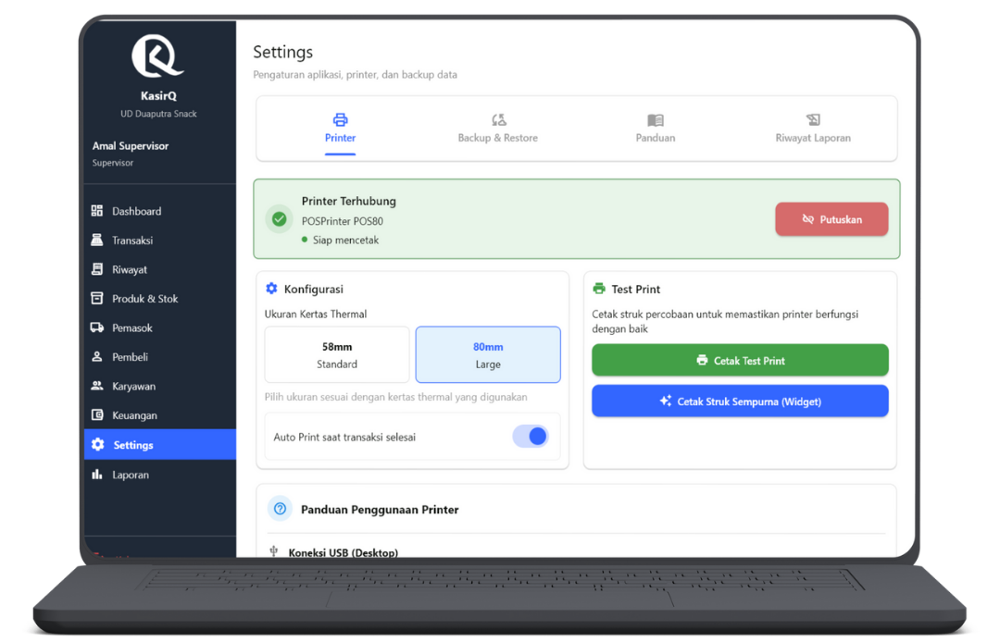
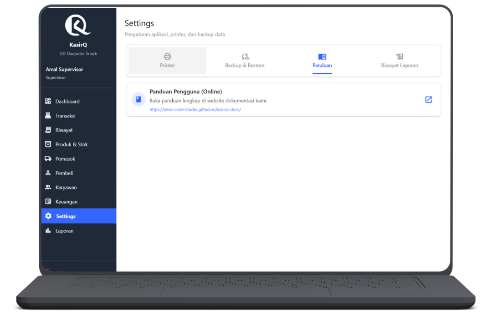
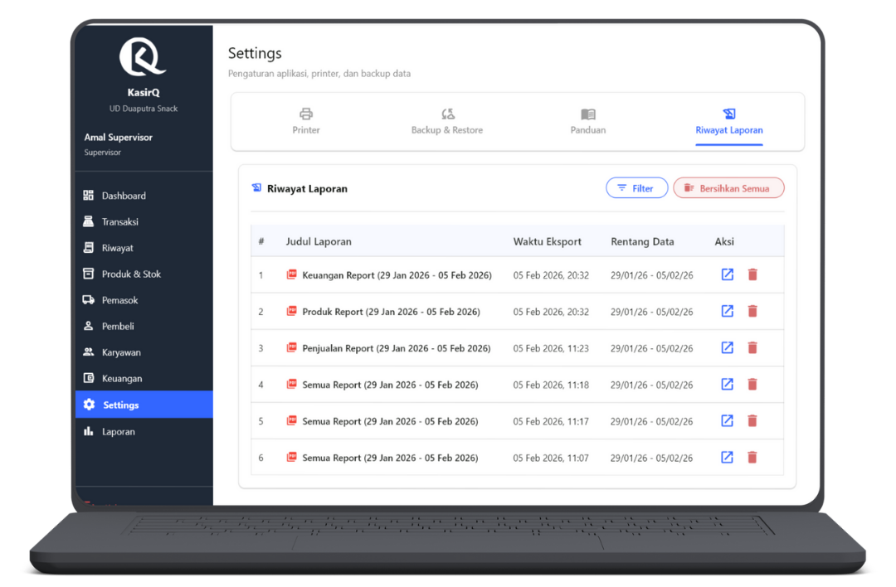

# Pengaturan Aplikasi

  👤 Role: Supervisor

Halaman **Pengaturan Aplikasi** digunakan oleh **Supervisor** untuk melakukan konfigurasi teknis sistem KasirQ yang berpengaruh langsung terhadap proses transaksi, keamanan data, pencetakan struk, serta manajemen laporan.

Seluruh fitur pada halaman ini **bersifat kritikal** dan hanya dapat diakses oleh pengguna dengan hak akses **Supervisor**.

---

## Ringkasan Tab

Pengaturan Aplikasi terdiri dari **4 tab utama**:

1. **Printer** – Konfigurasi dan pengujian printer thermal
2. **Backup & Restore** – Pengamanan dan pemulihan data aplikasi
3. **Panduan** – Akses dokumentasi resmi KasirQ
4. **Riwayat Laporan** – Riwayat file laporan yang pernah diekspor

---

## Tab 1 — Printer

Tab ini digunakan untuk mengatur seluruh kebutuhan pencetakan struk transaksi menggunakan printer thermal.

---

### Status & Informasi Printer

Card ini menampilkan status printer yang sedang terhubung dengan aplikasi.

Informasi yang ditampilkan meliputi:
- Status koneksi printer (Terhubung / Tidak Terhubung)
- Nama printer aktif
- Indikator kesiapan mencetak
- Jenis koneksi (USB, Bluetooth, atau Network)

Tersedia tombol **Putuskan Printer** untuk memutus koneksi printer secara manual tanpa perlu menutup aplikasi.

:::info Catatan
Memutuskan printer tidak menghapus konfigurasi. Printer dapat disambungkan kembali kapan saja.
:::

---

### Konfigurasi Ukuran Kertas Thermal

Digunakan untuk menyesuaikan ukuran kertas struk agar hasil cetak tidak terpotong.

Pilihan ukuran:
- **58mm** — Printer thermal kecil / portable
- **80mm** — Printer POS ukuran besar

Perubahan ukuran kertas akan langsung memengaruhi layout struk transaksi.

---

### Auto Print Setelah Transaksi

Fitur ini menentukan apakah struk akan dicetak otomatis setelah transaksi selesai.

- **ON** → Struk langsung dicetak setelah transaksi berhasil
- **OFF** → Kasir mencetak struk secara manual

:::tip Rekomendasi
Aktifkan fitur ini untuk toko dengan volume transaksi tinggi agar proses kasir lebih cepat.
:::

---

### Test Print

Digunakan untuk memastikan printer dan konfigurasi cetak berjalan dengan benar.

Aksi yang tersedia:
- **Cetak Test Print** – Mencetak struk uji sederhana
- **Cetak Struk Sempurna** – Mencetak contoh struk lengkap untuk validasi layout

---

### Panduan Penggunaan Printer

Berisi panduan teknis penggunaan printer, mencakup:
- Koneksi USB (Desktop)
- Koneksi Bluetooth
- Koneksi Network (WiFi / LAN)
- Instalasi driver printer (Windows)
- Penyesuaian ukuran kertas
- Solusi masalah umum printer tidak mencetak

---

## Tab 2 — Backup & Restore

Tab ini digunakan untuk menjaga keamanan data dan melakukan pemulihan jika terjadi kesalahan atau kehilangan data.

---

### Backup Data

Fitur backup digunakan untuk menyimpan seluruh data aplikasi ke dalam satu file database.

Data yang dibackup meliputi:
- Transaksi
- Produk & stok
- Pelanggan
- Keuangan
- Laporan

File backup disimpan dalam format `.db` dan dapat disimpan di komputer pengguna.

---

### Restore Data

Digunakan untuk mengembalikan data aplikasi dari file backup yang sudah ada.

:::warning Peringatan
Proses restore akan menimpa seluruh data aplikasi yang sedang aktif dan tidak dapat dibatalkan.
:::

---

### Reset Data

Reset digunakan untuk membersihkan data aplikasi sesuai kebutuhan operasional.

#### Soft Reset
Menghapus:
- Transaksi
- Keuangan
- Riwayat stok
- Notifikasi

Data yang tetap aman:
- Produk
- Pelanggan
- User / Karyawan
- Laporan ringkasan

#### Full Reset
Menghapus:
- Seluruh data aplikasi
- Riwayat laporan

Opsional:
- Menghapus master data (Produk & Pelanggan)

:::warning Perhatian
Full Reset merupakan tindakan ekstrem dan sebaiknya dilakukan setelah melakukan backup.
:::

---

## Tab 3 — Panduan

Tab ini menyediakan akses ke **dokumentasi online resmi KasirQ**.

Panduan dapat diakses melalui browser dan mencakup:
- Cara penggunaan fitur
- Alur transaksi
- Manajemen stok & laporan
- Troubleshooting umum

---

## Tab 4 — Riwayat Laporan

Menampilkan daftar laporan yang pernah diekspor dari menu Laporan.

---

### Filter Riwayat

Filter yang tersedia:
- Semua data
- Setelah tanggal tertentu
- Sebelum tanggal tertentu
- Rentang tanggal

Tersedia tombol **Hapus Semua Riwayat** untuk membersihkan daftar laporan.

---

### Tabel Riwayat Laporan

Kolom tabel:
- Judul laporan
- Waktu ekspor
- Rentang data
- Aksi:
  - Buka laporan
  - Hapus riwayat

Riwayat ini mencatat seluruh laporan yang diekspor, seperti:
- Laporan penjualan
- Laporan produk
- Laporan keuangan
- Laporan gabungan

---

## Tanggung Jawab Supervisor

:::danger Penting
Sebagai Supervisor, pengguna bertanggung jawab untuk:
- Mengatur konfigurasi printer agar struk tercetak dengan benar
- Melakukan backup data secara berkala
- Menghindari penggunaan reset tanpa kebutuhan jelas
- Menjaga keamanan data aplikasi
- Memastikan laporan tersimpan dan dikelola dengan baik
:::

---

## FAQ

**Q: Apakah backup otomatis tersedia?**  
A: Saat ini backup dilakukan secara manual agar Supervisor memiliki kontrol penuh terhadap data.

**Q: Apakah kasir bisa mengakses pengaturan aplikasi?**  
A: Tidak. Seluruh menu Pengaturan Aplikasi hanya dapat diakses oleh Supervisor.

**Q: Apakah menghapus riwayat laporan menghapus data laporan?**  
A: Tidak. Yang dihapus hanya file hasil ekspor, bukan data laporan di sistem.

**Q: Apa yang harus dilakukan sebelum melakukan reset data?**  
A: Selalu lakukan backup terlebih dahulu untuk menghindari kehilangan data permanen.
