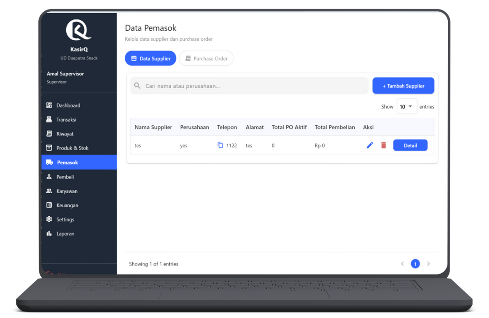
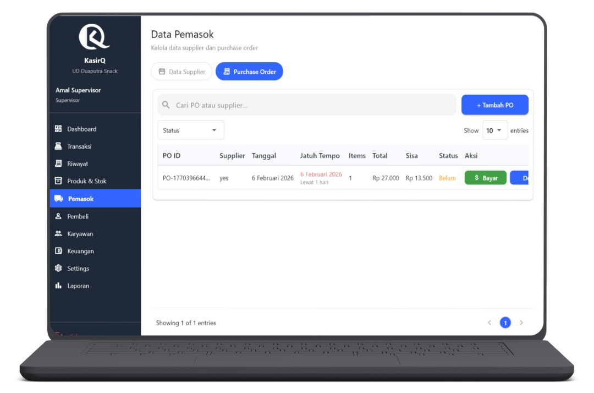

# Kelola Pemasok & Purchase Order

  👤 Role: Supervisor

Halaman **Kelola Pemasok & Purchase Order** digunakan oleh Supervisor untuk mengelola data pemasok (supplier) serta proses **penambahan stok melalui Purchase Order (PO)** dengan sistem **barang datang dulu, pembayaran menyusul (jatuh tempo)**.

Fitur pada halaman ini dibagi menjadi **2 tab utama** untuk memisahkan pengelolaan data dan transaksi pembelian.

---

## Ringkasan Tab

1. **Data Supplier** – Kelola data pemasok
2. **Purchase Order** – Kelola pembelian stok dan pembayaran bertahap

---

## Tab 1 — Data Supplier

Tab **Data Supplier** digunakan untuk mengelola seluruh data pemasok yang bekerja sama dengan toko.

### Fitur Utama

Supervisor dapat:
- Mencari supplier
- Menambah supplier
- Melihat detail supplier
- Mengedit supplier
- Menghapus supplier

---

### Pencarian Supplier

Kolom pencarian mendukung pencarian berdasarkan:
- **Nama supplier**
- **Nama perusahaan**

Pencarian bersifat **real-time**.

---

### Tambah Supplier

Klik tombol **Tambah Supplier** untuk membuka form.

#### Form Tambah / Edit Supplier

Field yang wajib diisi:
- Nama kontak supplier
- Nama perusahaan
- Nomor telepon
- Alamat
- Kategori yang disupply

Kategori digunakan sebagai referensi produk apa saja yang biasa disediakan oleh supplier tersebut.

---

### Tabel Data Supplier

| Kolom | Deskripsi |
|----|----|
| Nama Supplier | Nama kontak |
| Perusahaan | Nama perusahaan |
| Telepon | Nomor yang dapat dihubungi |
| Alamat | Alamat supplier |
| Total PO Aktif | Jumlah PO belum lunas |
| Total Pembelian | Akumulasi nilai pembelian |
| Aksi | Detail / Edit / Hapus |

---

### Detail Supplier

Tombol **Detail** akan menampilkan:
- Informasi lengkap supplier
- Daftar kategori yang disupply
- Ringkasan histori purchase order
- Total pembelian keseluruhan

Halaman detail bersifat **informational (read-only)**.

---

### Show Entries & Pagination

- Show entries: 10 / 20 / 50
- Pagination untuk navigasi data supplier

---

## Tab 2 — Purchase Order

Tab **Purchase Order** digunakan untuk mencatat pembelian stok dari supplier dengan sistem **jatuh tempo pembayaran**.

---

### Fitur Utama

Supervisor dapat:
- Membuat PO baru
- Mencari PO atau supplier
- Melihat status pembayaran
- Melakukan pembayaran PO
- Melihat detail PO

---

### Pencarian & Filter

- Pencarian berdasarkan:
  - **ID PO**
  - **Nama supplier**
- Filter status:
  - **Belum Lunas**
  - **Lunas**
- Show entries
- Pagination

---

### Tambah Purchase Order

Klik tombol **Tambah PO** untuk membuka form.

#### Informasi Umum

- Pilih supplier
- Tentukan tanggal jatuh tempo pembayaran

---

#### Tambah Produk ke PO

- Cari produk berdasarkan **nama atau barcode**
- Klik hasil pencarian untuk menambahkan ke tabel PO
- Produk yang ditambahkan akan muncul di tabel daftar barang

##### Tabel Daftar Barang PO

| Kolom | Deskripsi |
|----|----|
| Produk | Nama produk |
| Qty | Jumlah dibeli *(editable)* |
| Harga | Harga beli satuan *(editable)* |
| Subtotal | Qty × Harga |
| Aksi | Hapus item |

---

#### Total PO

Di bagian bawah tabel akan ditampilkan:
- **Total keseluruhan nilai PO**

Setelah semua data sesuai, klik **Buat PO**.

:::info Catatan
Saat PO dibuat:
- Stok **langsung bertambah**
- Status PO otomatis **Belum Lunas**
:::

---

### Tabel Purchase Order

| Kolom | Deskripsi |
|----|----|
| PO ID | Kode unik purchase order |
| Supplier | Nama supplier |
| Tanggal | Tanggal PO dibuat |
| Jatuh Tempo | Tanggal + sisa hari |
| Items | Jumlah item |
| Total | Total nilai PO |
| Sisa Belum Dibayar | Nilai outstanding |
| Status | Belum Lunas / Lunas |
| Aksi | Bayar / Detail |

---

### Pembayaran PO

Klik tombol **Bayar** untuk membuka dialog pembayaran.

#### Informasi PO

Ditampilkan secara ringkas:
- Supplier
- Jatuh tempo
- Total PO
- Sudah dibayar
- Sisa yang harus dibayar

---

#### Form Pembayaran

Field pembayaran:
- Jumlah pembayaran
- Tombol bantuan:
  - **Bayar Lunas**
  - **Bayar 50%**
- Jatuh tempo berikutnya *(jika ada perpanjangan)*
- Metode pembayaran

Klik **Bayar** untuk menyimpan pembayaran.

:::warning Perhatian
Pembayaran parsial akan:
- Mengurangi sisa tagihan
- Memperbarui jatuh tempo jika diubah
:::

---

### Detail Purchase Order

Tombol **Detail** menampilkan:

#### Informasi Umum
- Supplier
- Status PO
- Jatuh tempo
- Total PO

#### Daftar Item PO

| Produk | Qty | Harga Satuan | Subtotal |
|----|----|----|----|

#### Rincian Pembayaran

Jika sudah ada pembayaran, akan muncul tabel:
- Tanggal pembayaran
- Jumlah dibayar
- Metode pembayaran

---

## Tanggung Jawab Supervisor

:::danger Penting
Supervisor bertanggung jawab atas:
- Keakuratan data supplier
- Validitas purchase order
- Ketepatan jatuh tempo
- Pencatatan pembayaran
- Transparansi hutang pembelian
- Dampak PO terhadap stok dan keuangan
:::

Kesalahan input PO atau pembayaran akan berdampak langsung pada laporan keuangan dan stok.

---

## FAQ — Supplier & Purchase Order

**Q: Apakah stok langsung bertambah saat PO dibuat?**  
A: Ya. PO dianggap barang sudah diterima.

**Q: Apakah PO bisa dibayar sebagian?**  
A: Bisa. Sistem mendukung pembayaran bertahap.

**Q: Apakah jatuh tempo bisa diubah saat bayar?**  
A: Bisa, jika ada kesepakatan perpanjangan dengan supplier.

**Q: Apakah PO bisa dihapus?**  
A: Tidak jika sudah memiliki pembayaran.

**Q: Kenapa supplier tidak bisa dihapus?**  
A: Supplier tidak dapat dihapus jika masih memiliki PO aktif.

---

Halaman ini bersifat **sensitif terhadap stok dan keuangan**  
dan **hanya dapat diakses oleh Supervisor**.
